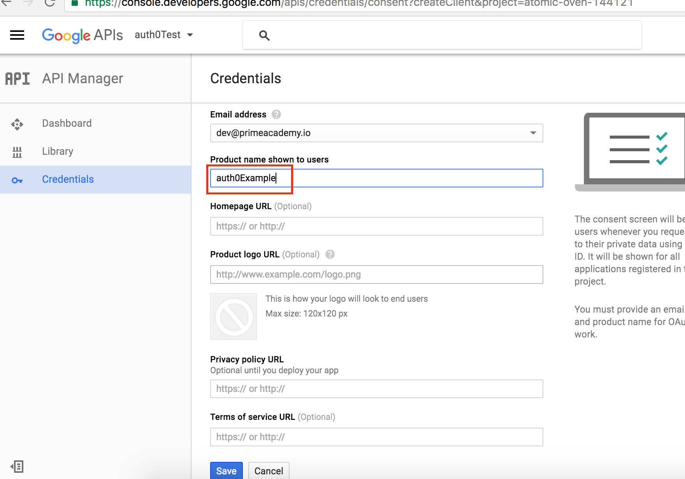
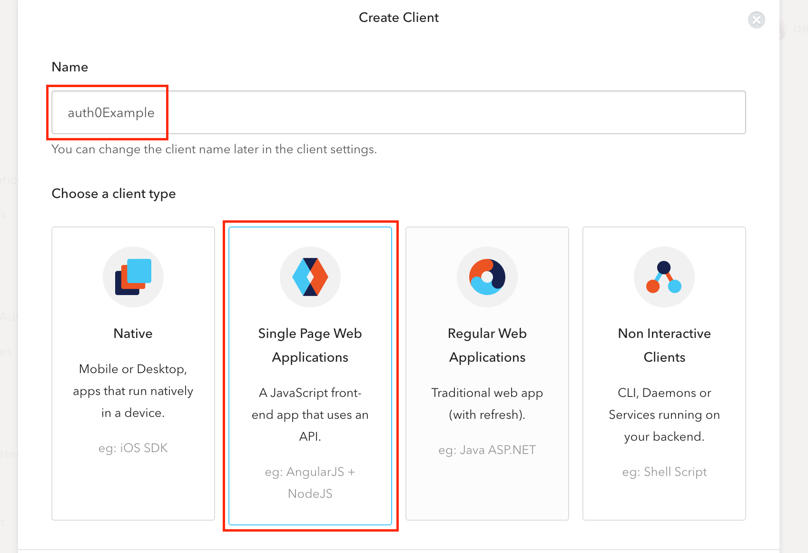
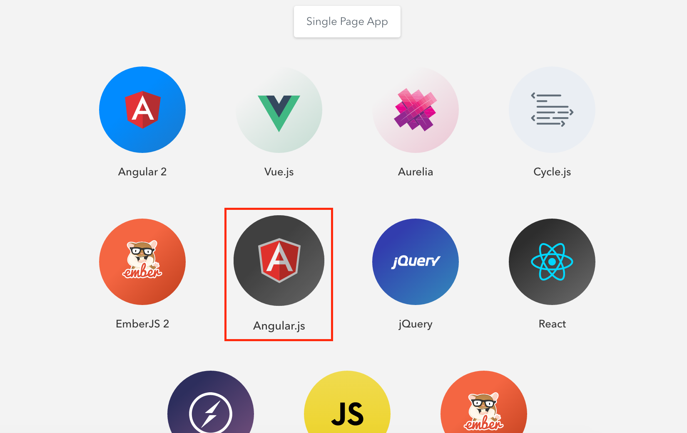
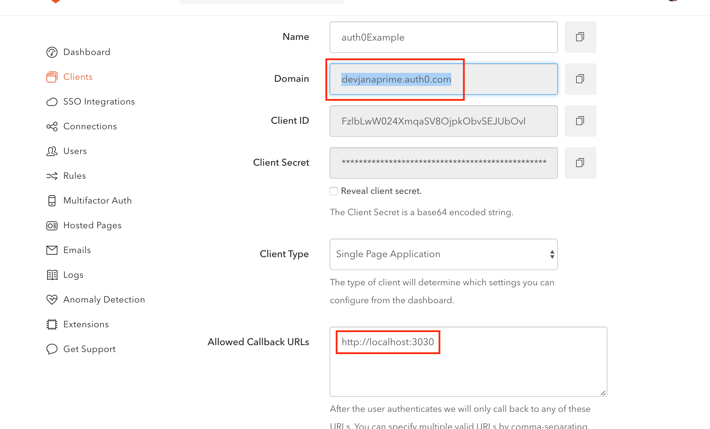
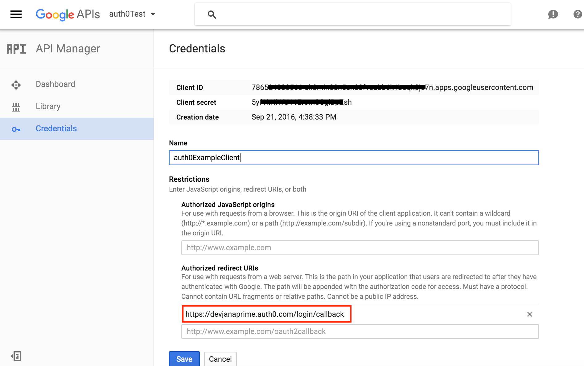

Auth0 Example
=============

In this example project we'll user Auth0 to allow user to log in to our site via a Google account. This requires some setup with an Auth0 account, a Google developer account, and our page itself.

Needed Accounts
--------------
First, create an account with Auth0 an a google developer account:

* https://auth0.com/
* https://console.developers.google.com/

Account Setup
=============

Initial Google setup
--------------------
First, we'll need to create a new project:

Once our new project is created, we'll want to create some credentials for this project and set it as an OAuth project.

Now that we've got a new OAuth project we'll need to configure the consent screen. This is the screen that tells the users what our app will be accessing of their profile. We'll be accessing only enough to prove they are real.

On the next screen, let's give our product a name and ill in any other info if you have it ready.

On the next screen we'll choose that this is a Web Application and give the client for our application a name.

Save your work and keep this page open in a tab. We'll be coming back to it later.

Auth0 setup
-----------
First, we'll want to create a "client" on Auth0. This will be what talks to Google to get out authentication working.

Let's give our client a name and choose "Single Page Web Application".

We'll be using Angular, of course.

Once our app is created, take note of the domain as listed here. Copy it.

Also, in the "Allowed Callback URLs" text area, input the domains from which this app will be receiving calls. For this example we'll be using 'http://localhost:3030'.
Note: if you deploy to something like Heroku, you'll need to add the URLs here.

Keep the Auth0 tab open as well. We'll bounce back/forth between both and our app until we've got all working.

Connecting Auth0 and Google
---------------------------
In your Google Tab, we'll need to add the domain from our Auth0 tab in the "Authorized Redirect URIs" field. Not that you may need to add "https://" a the front of the domain.

This tells Google that it is acceptable for this Auth0 domain to make authentication requests.

Back in the Auth0 tab, Expand the "Connections" menu item and choose "social". From here you'll be able to choose two social authentication endpoints (in the free version). We'll be using Google so make sure that is turned on.

Next we need to use the "Client ID" and "Client Secret" from our Google project and tell Auth0 about it. Copy these from the Google tab and paste them into the appropriate fields in the Auth0 tab.

These connections should now be set up and we've got to add Auth0's functionality to our app.

Setting up our project
======================
