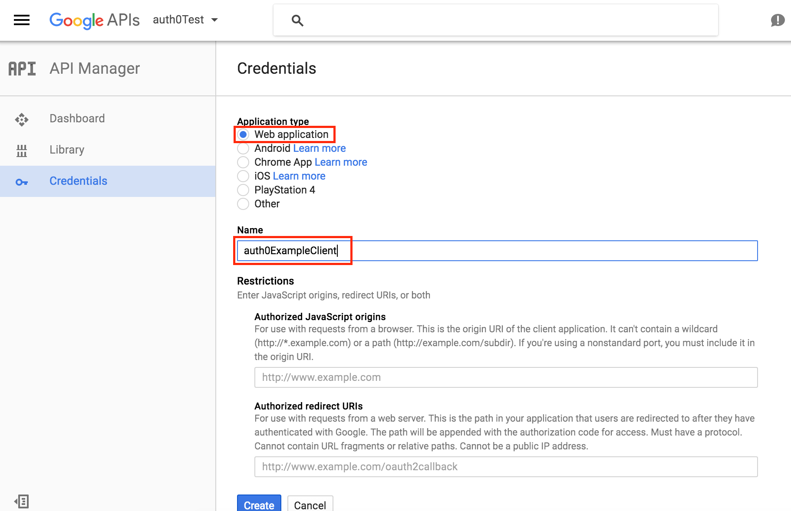
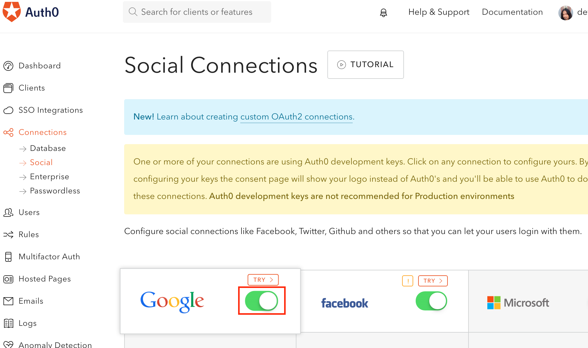
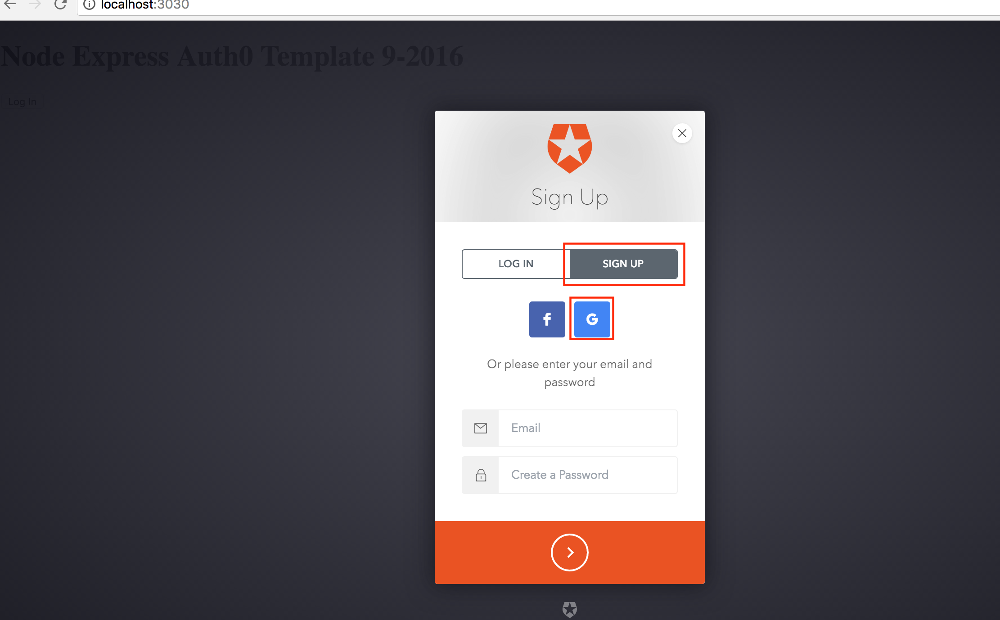
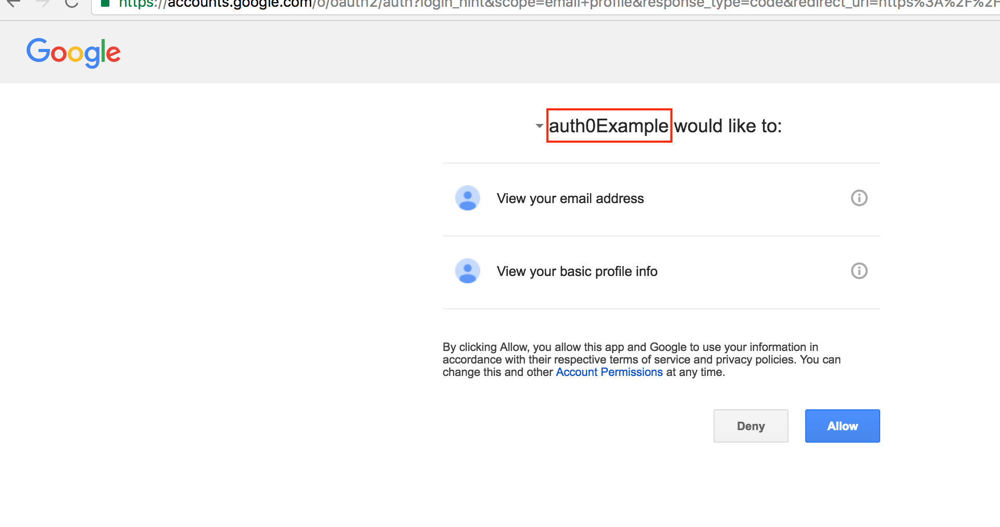
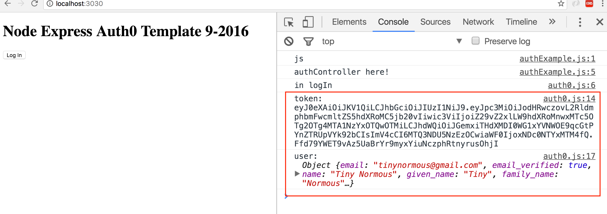

Auth0 Example
=============

In this example project we'll user Auth0 to allow user to log in to our site via a Google account. This requires some setup with an Auth0 account, a Google developer account, and our page itself.

Needed Accounts
--------------
First, create an account with Auth0 an a google developer account:

* https://auth0.com/
* https://console.developers.google.com/

Account Setup
=============

Initial Google setup
--------------------
First, we'll need to create a new project:


Once our new project is created, we'll want to create some credentials for this project and set it as an OAuth project.


Now that we've got a new OAuth project we'll need to configure the consent screen. This is the screen that tells the users what our app will be accessing of their profile. We'll be accessing only enough to prove they are real.


On the next screen, let's give our product a name and ill in any other info if you have it ready.


On the next screen we'll choose that this is a Web Application and give the client for our application a name.



Save your work and keep this page open in a tab. We'll be coming back to it later.

Auth0 setup
-----------
First, we'll want to create a "client" on Auth0. This will be what talks to Google to get out authentication working.


Let's give our client a name and choose "Single Page Web Application".


We'll be using Angular, of course.


Once our app is created, take note of the domain as listed here. Copy it.

Also, in the "Allowed Callback URLs" text area, input the domains from which this app will be receiving calls. For this example we'll be using 'http://localhost:3030'.
Note: if you deploy to something like Heroku, you'll need to add the URLs here.


Keep the Auth0 tab open as well. We'll bounce back/forth between both and our app until we've got all working.

Connecting Auth0 and Google
---------------------------
In your Google Tab, we'll need to add the domain from our Auth0 tab in the "Authorized Redirect URIs" field. Not that you may need to add "https://" a the front of the domain.

This tells Google that it is acceptable for this Auth0 domain to make authentication requests.


Back in the Auth0 tab, Expand the "Connections" menu item and choose "social". From here you'll be able to choose two social authentication endpoints (in the free version). We'll be using Google so make sure that is turned on.



Next we need to use the "Client ID" and "Client Secret" from our Google project and tell Auth0 about it. Copy these from the Google tab and paste them into the appropriate fields in the Auth0 tab.


These connections should now be set up and we've got to add Auth0's functionality to our app.


Setting up our project
======================
Start with a basic Node/Express/Angular project. The example project simply spins up a server on port 3030 and serves an index.html file. Also, I've included a scripts folder within which we've got a file named "auth0.js". This has some helper functionality in there that we'll use.

We'll source in that file as well as some setup from Auth0:

```javascript
<!-- auth0 setup -->
<script src="https://cdn.auth0.com/js/lock-8.1.min.js"></script>
<meta name="viewport" content="width=device-width, initial-scale=1.0, maximum-scale=1.0, user-scalable=no" />
<script src="vendors/angular.min.js" charset="utf-8"></script>
<!-- auth0 helper -->
<script src="scripts/auth0.js" charset="utf-8"></script>
<script src="scripts/authExample.js" charset="utf-8"></script>
```

Yes, I know... normally I'd avoid using the CDN for serving a vendor file, but in this case the user will need to be connected to the web to authenticate anyway and we'll need Auth0's servers up to check to it should be fine. The viewport is there for the overlay that we'll see when things are working.

Next, we'll add a button to the page and hook it up to an ng-click that will run the login functionality.

```html
<body ng-app='myApp'>
  <h1>Node Express Auth0 Template 9-2016</h1>
  <button ng-controller='authController' ng-click='logInButton()'>Log In</button>
</body>
```

This will, of course, also require an angular module and controller. These are kept as simple as possible here:

```javascript
console.log( 'js' );
var myApp=angular.module( 'myApp', [] );

myApp.controller( 'authController', [ '$scope', function( $scope ){
  console.log( 'authController here!');
  $scope.logInButton = function(){
    // call out logIn function from auth0.js
    logIn();
  }; // end scope.logIn
}]); // end authController
```

This just runs the "$scope.logInButton" function on button click that runs the "logIn" function in auth0.js. For our first tests, this is all we should need in our js file as well as our htm file.

However, we still need to do a little configurating in auth0.js. I hope you haven't closed your browser tabs...

At the top of auth0.js is the following line:

```javascript
var lock = new Auth0Lock( 'CLIENTID', 'DOMAIN');
```

* Replace CLIENTID with the Client ID from your Auth0 tab in the web browser.
* Replace DOMAIN with the domain from the same page (should look like YOURNAME.auth0.com)

Time to test!
-------------
* take a deep breath
* cross your fingers
* spin up your server
* open your page in a new tab
* click the "Log In" button

If things are set up correctly you should see the Auth0 popup login box



Choose "Sign Up" and click the Google logo. You should be taken to a page that shows the name of your app and the access to the user's google account that was set in your Google setup phase earlier.



Once you accept you should be logged in. In this example we're really just logging out the token for this user's logged in session as well as the user object.



Next steps
----------
* return the object from the logIn function in auth0.js to return the user object.
* Show a "welcome back, USER" message instead of the "Log In" button now that the user has logged in
* Research and implement a different social log in, facebook perhaps?
* in Chrome's DevTools, checkout the Application tab and the "localstorage" section. This can be accessed in js. (try 'localStorage.userProfile' in the console and in a js file) What can you do with this object?
* add "log out" functionality
* discuss with your cohortmates how this functionality could be used for solo projects, group projects, or added to existing projects

https://www.youtube.com/watch?v=Q7_jbluF0qo
